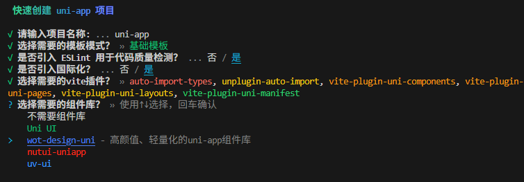

<h1 align="center">✨💚create uni💚✨</h1>

<p align="center">
    <a href="https://github.com/uni-helper/create-uni/stargazers"></a>
    <a href="https://www.npmjs.com/package/create-uni"></a>
    <a href="https://www.npmjs.com/package/create-uni"></a>
</p>

<h2 align="center">
<sub> >_ Easy to use create uni-app-vue3-vite-template▌ </sub>
</h2>

# 📦 使用

```shell
# npm
    npm create xiaoiron-uni-ci@latest

# pnpm
    pnpm create xiaoiron-uni-ci
```

> [!TIP]
> 建议添加上标记名（@latest），否则 npm 可能会解析到缓存的过时软件包版本。

## 📖 介绍

`xiaoiron-uni-ci` 是一个用于快速创建 uni-app 项目的轻量脚手架工具，它可以帮助你快速创建一个基于`vite`和`vue3`的`uni-app`项目，同时提供了一些模板供你选择。

<p align="center"></p>

## 🚤 快速使用

```shell
npx create-uni@latest --info
# --info  获取当前项目环境信息
```

### 参数说明

| 配置项 | 参数 | 别名 | 可选值 |
|  :---: | :---: | :---: | :---: |
| Plugin | pluginList | p | 见[插件列表](#插件列表) |
| UI | ui | u | 见[组件列表](#组件列表) |
| Eslint | eslint | e | —— |
| 国际化 | vue-i18n | e | —— |
#### 📦插件列表

| 插件名 | 描述 | 参数名 |
| :---: | :---: | :---: |
| [vite-plugin-uni-components](https://github.com/uni-helper/vite-plugin-uni-components) | 按需自动引入组件 | import |
| [vite-plugin-uni-pages](https://github.com/uni-helper/vite-plugin-uni-pages) | 提供基于文件系统的路由 | pages |
| [vite-plugin-uni-layouts](https://github.com/uni-helper/vite-plugin-uni-layouts) | 提供类 nuxt 的 layouts 系统 | layouts |
| [vite-plugin-uni-manifest](https://github.com/uni-helper/vite-plugin-uni-manifest) | 自动生成 manifest.json 文件 | manifest |
| [vite-plugin-uni-platform](https://github.com/uni-helper/vite-plugin-uni-platform) | 基于文件名 (*.<h5\|mp-weixin\|app>.*) 的按平台编译插件 | filePlatform |
| [vite-plugin-uni-platform-modifier](https://github.com/uni-helper/vite-plugin-uni-platform-modifier) | 为属性、指令提供平台修饰符并按需编译 | platformModifier |
| [vite-plugin-uni-middleware](https://github.com/uni-helper/vite-plugin-uni-middleware) | 使用路由中间件 | middleware |

#### 📦组件列表

| 组件名 | 描述 | 参数名 |
| :---: | :---: | :---: |
| [Uni UI](https://uniapp.dcloud.net.cn/component/uniui/uni-ui.html) | UniApp官方组件库 | uni |
| [wot-design-uni](https://wot-design-uni.pages.dev/) | 高颜值、轻量化的uni-app组件库 | wot |
| [nutui-uniapp](https://uniapp-nutui.tech/) | 京东风格的轻量级移动端组件库 | nut |
| [uv-ui](https://www.uvui.cn/components/intro.html) | 多平台快速开发的UI框架 | uv |

## 🛠️ 环境要求
Vite 需要 Node.js 版本 18+ 或 20+

## 🤝 参与贡献

- 提交新功能
- 解决[`issues`](https://github.com/uni-helper/create-uni/issues)
- 提交新[`模板`](./src/question/template/)/[`Plugin`](./src/question/plugin/choices.ts)/[`module`](./src/question/module/choices.ts)/[`UI`](./src/question/UI/)

## 🌸 感谢

项目灵感及部分代码来自 [create-vue](https://github.com/vuejs/create-vue)

## 📄 License

[MIT LICENSE](./LICENSE)

## 🙇🏻‍♂️[赞助](https://afdian.com/a/flippedround)

<p align="center">
  <a href="https://afdian.com/a/flippedround">
    
  </a>
</p>
